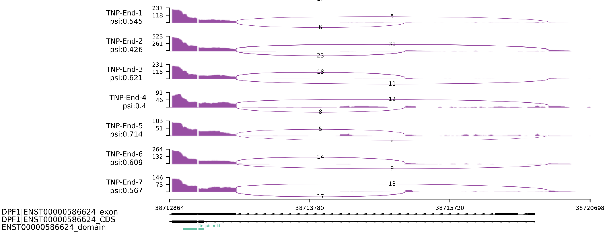

# Massageplot[](https://opensource.org/licenses/MIT)

## Usage

```
Usage: sashimiplot [OPTIONS] COMMAND [ARGS]...

  A pure python sashimiplot, support the protein domain. Version: 1.1.0

Options:
  --help  Show this message and exit.

Commands:
  gene
  junc

```

## subcommand

### gene

add single gene model into your sashimiplot.

```
Usage: sashimiplot [OPTIONS] COMMAND [ARGS]...

  A pure python sashimiplot, support the protein domain. Version: 1.0.0

Options:
  --help  Show this message and exit.

Commands:
  gene  Normal mode to generate sashimi plot
  junc  Junction mode, not need network to plot
  site  site mode, plot the last site coverage of the gene direction

``` 

### junc

just for plot the sashimiplot

```
Usage: sashimiplot junc [OPTIONS]

  Junction mode, not need network to plot

Options:
  --gtf TEXT         The gtf file.
  --bam TEXT         Bam config file. There were two columns, label and file
                     path
  --fileout TEXT     The output name.
  --junc TEXT        The junction, it looks like chr:s:e
  --sj INTEGER       Only values greater than a certain value are displayed.
                     default: 1
  --pa TEXT          The pA site, if there were multiple sites, pls seperate
                     by `,`. default: None
  --focus TEXT       Highlight the given region. for one region: start-end, if
                     multiple, pls seperate by ,
  --ps TEXT          Library type, FR or RF.
  --peakfilter TEXT  peaks filter, default: None.
  --log TEXT         plot the log-tranformed expression values, and support
                     log2 and log10. default: None
  --prob TEXT        probability, given a region
  --id_keep TEXT     keep the given isoform, if there were multiple isoform
                     id, please seperate by comma
  --ssm TEXT         single-strand mode(ssm), given R1 or R2
  --ade              add expression for plot.
  --domain           add gene structure.
  --model TEXT       The deep learning model.
  --hl TEXT          highlight the given splice junction.egg, sj1:sj2,sj3:sj4
  --dim TEXT         The picture's size,(width, height), default: 8,12
  --help             Show this message and exit.

```

### site

plot the reads coverage based the most 3' site

```
Usage: sashimiplot site [OPTIONS]

  site mode, plot the last site coverage of the gene direction

Options:
  --gtf TEXT         The gtf file.
  --bam TEXT         Bam config file. There were two columns, label and file
                     path
  --fileout TEXT     The output name.
  --loc TEXT         The junction, it looks like chr:s:e
  --peakfilter TEXT  peaks filter, default: None.
  --verbose          set the logging level, if Ture -> INFO
  --log TEXT         plot the log-tranformed expression values, and support
                     log2 and log10. default: None
  --help             Show this message and exit.

```
